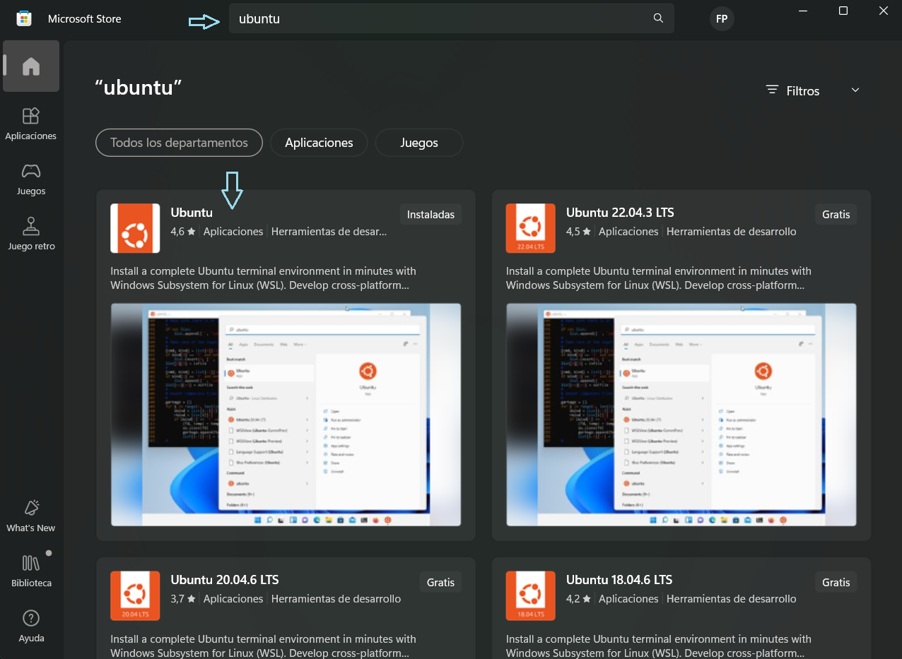
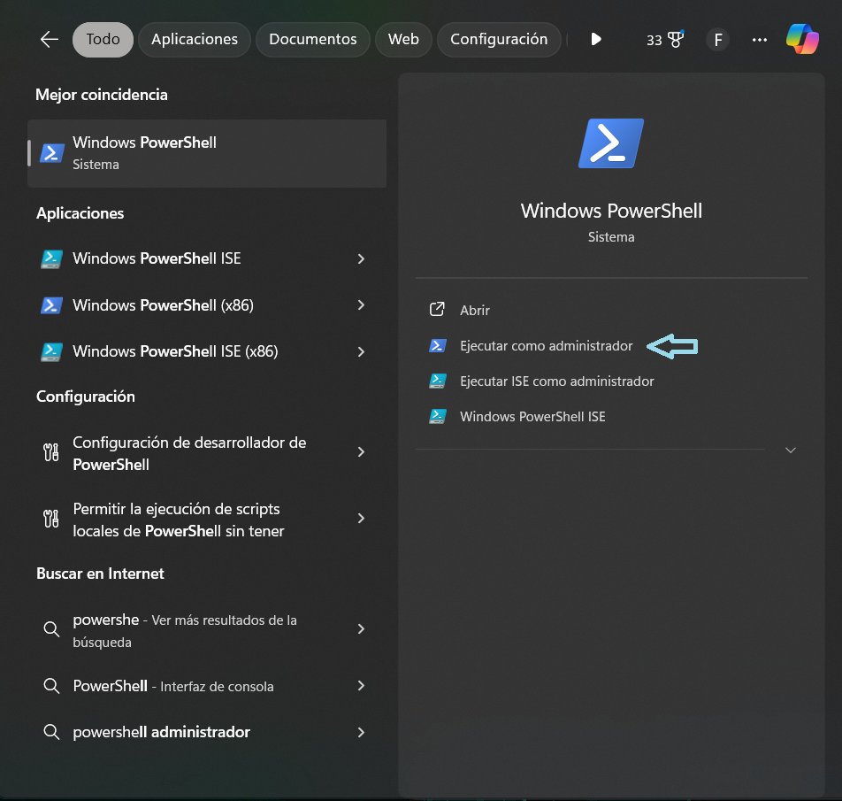

# Instalación de la terminal Ubuntu en Windows

Estas indicaciones son exclusivamente para personas que utilizan un sistema operativo Windows, ya que en el caso de macOS este se basa en Linux, por lo que es posible realizar la gran mayoría de las acciones que se hacen en Linux sin necesidad de instalar una máquina virtual.

## Identificación de la máquina virtual
Para instalar la máquina virtual, nos dirigiremos a Microsoft Store, que se encuentra en la barra inferior o bien se puede buscar directamente en la lupa de Windows.

Una vez dentro de Microsoft Store, buscamos Ubuntu en la barra de búsqueda ubicada en la parte superior central de la ventana y seleccionamos la primera opción, desarrollada por Canonical Group Limited, tal como se indica en la siguiente imagen:



Esperamos a que la aplicación se descargue e instale. Mientras este proceso continúa, pasaremos al siguiente paso.

## Instalación de WSL

Mientras la máquina virtual se descarga, realizaremos la instalación de `WSL` (Windows Subsystem for Linux), que es el programa que permite que Linux se ejecute dentro de Windows. Para esto, abrimos Windows PowerShell como administrador.



En la terminal de PowerShell iniciamos la instalación de `WSL` con el siguiente comando:

```powershell
wsl --install
```

Una vez finalizada la instalación de `WSL`, verificamos si Ubuntu ya se instaló. Cuando ambos procesos estén completos y antes de iniciar Ubuntu, es necesario reiniciar el PC para que se guarden todos los cambios.

Después del reinicio, podremos abrir la terminal de Ubuntu.

## **Consideraciones importantes**
Al abrir Ubuntu por primera vez, se nos pedirá ingresar una contraseña para nuestro usuario. Esta clave es fundamental, ya que será requerida cada vez que queramos realizar una instalación o modificación en el sistema que requiera permisos de superusuario. Ten en cuenta lo siguiente:

1) Al momento de escribir la contraseña, **no aparecerá ningún carácter en pantalla.** Esto es normal en Linux, por lo que debemos estar seguros de lo que escribimos.

2) **No olvidar la contraseña**. Se recomienda anotarla en un lugar seguro y de difícil acceso para terceros.

